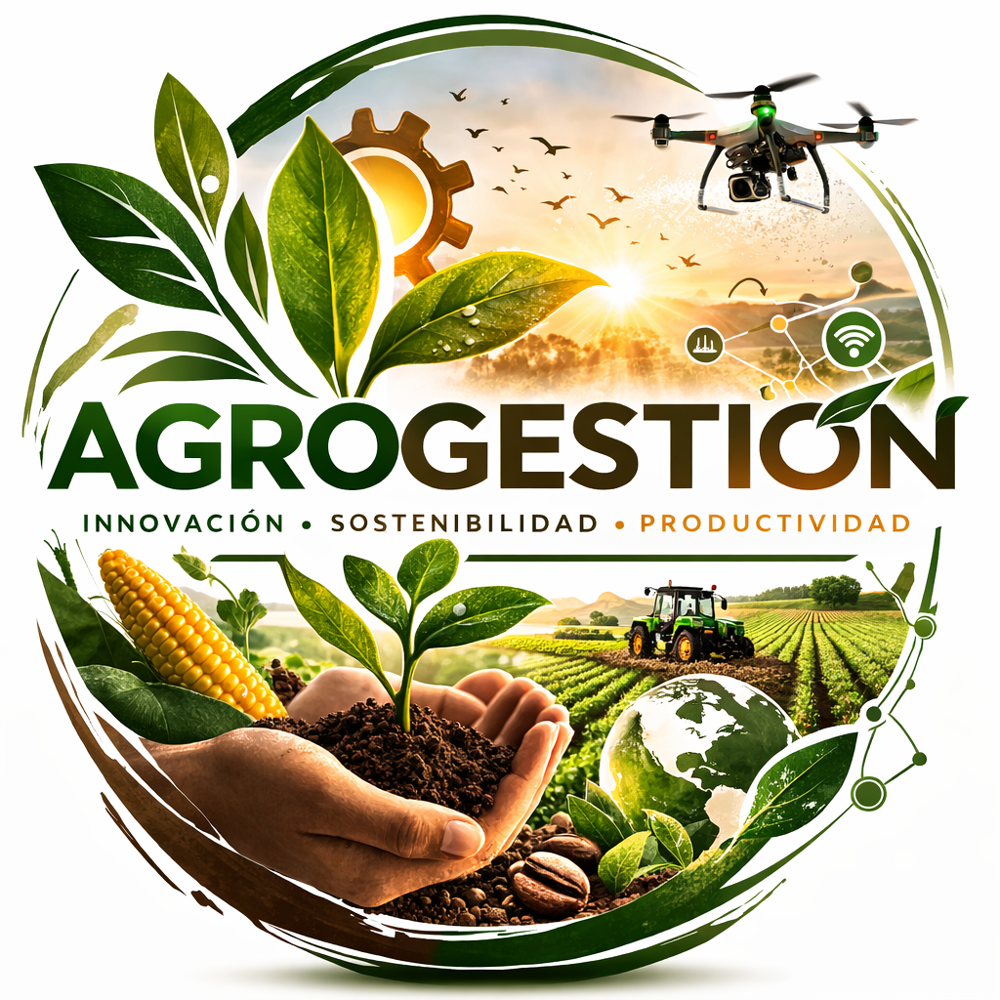

<div align="center">
  
  <h1>🌾 Agrogestión</h1>
  <p><strong>Gestión agrícola web — Proyecto final DAW</strong></p>
  <p>🔗 <a href="https://agrogestion-web.vercel.app/">https://agrogestion-web.vercel.app/</a></p>
  <p>
    
    
    
    
    
  </p>
</div>

---

Agrogestión es una aplicación web desarrollada como proyecto final del CFGS en Desarrollo de Aplicaciones Web (DAW). Permite gestionar usuarios, terrenos y tareas agrícolas utilizando una arquitectura moderna basada en **React 19**, **TypeScript**, **Vite 7**, **TailwindCSS 4** y **Supabase** como backend (auth + base de datos + API REST).

---

## 📑 Índice

- [🌍 Descripción general](#-descripción-general)
- [🗄️ Base de datos (Supabase)](#️-base-de-datos-supabase)
- [🧱 Estructura del proyecto](#-estructura-del-proyecto)
- [⚙️ Instalación y ejecución local](#️-instalación-y-ejecución-local)
- [🚀 Despliegue en Vercel](#-despliegue-en-vercel)
- [👤 Roles de usuario](#-roles-de-usuario)
- [🧠 Tecnologías principales](#-tecnologías-principales)
- [💻 Comandos útiles](#-comandos-útiles)
- [🧩 Funcionalidades implementadas](#-funcionalidades-implementadas)
- [📚 Documentación](#-documentación)
- [👨‍💻 Autoría](#-autoría)

---

## 🌍 Descripción general

Agrogestión digitaliza la organización del trabajo en explotaciones agrícolas, permitiendo coordinar el trabajo entre distintos roles desde el navegador.

- **Gestión jerárquica de roles:** administrador, gerente, capataz y trabajador.
- **Control de terrenos** con alta, baja lógica y edición.
- **Creación y seguimiento de tareas agrícolas** con 6 estados (pendiente, asignada, aceptada, rechazada, en progreso, completada).
- **Relaciones entre gerentes y capataces**, y asignación de trabajadores a tareas concretas.
- **Comentarios en tareas** para comunicación entre participantes, con indicador visual 💬 de número de comentarios.
- **Notificaciones automáticas** mediante triggers al asignar tareas y trabajadores, con **campanita 🔔 en la cabecera** para capataces y trabajadores (contador de no leídas, modal con historial y marcar como leídas).
- **Flujo de aceptación/rechazo** de tareas por parte de los trabajadores.
- **Internacionalización (i18n):** soporte para español, inglés y rumano.
- **Recuperación de contraseña** mediante Supabase Auth.
- **Gráficos y estadísticas** con tarjetas de resumen y gráficos mensuales.
- **Diseño responsive** con menú hamburguesa en móvil y tablas con scroll horizontal.
- **Acceso desde cualquier dispositivo** con interfaz limpia y adaptable.

---

## 🗄️ Base de datos (Supabase)

La base de datos se implementa en Supabase (PostgreSQL gestionado) aprovechando:

- Tablas relacionales con claves foráneas.
- Autenticación integrada de usuarios (JWT).
- Políticas RLS (Row Level Security) para limitar el acceso a los datos según el rol.
- Funciones RPC personalizadas (e.g. `isEmailTaken`).

**Tablas principales:**

| Tabla              | Descripción                                                                     |
|--------------------|---------------------------------------------------------------------------------|
| rol                | Tipos de usuario: ADMIN, GERENTE, CAPATAZ, TRABAJADOR.                          |
| perfiles           | Perfil extendido del usuario (nombre, apellidos, dni, email, rol, etc.).        |
| terreno            | Terrenos gestionados por los gerentes.                                          |
| estados_tarea      | 6 estados: PENDIENTE, ASIGNADA, ACEPTADA, RECHAZADA, EN_PROGRESO, COMPLETADA.  |
| tarea              | Tareas agrícolas vinculadas a terrenos, gerentes y capataces.                   |
| gerente_capataz    | Relación N:M entre gerentes y capataces.                                        |
| tarea_trabajador   | Trabajadores asignados a tareas con estado de aceptación.                       |
| capataz_trabajador | Relación estable entre capataz y sus trabajadores habituales.                   |
| comentarios_tarea  | Comentarios de los participantes en cada tarea.                                 |
| notificaciones     | Notificaciones automáticas generadas por triggers.                              |

**Scripts SQL incluidos** en `src/database/supabase/`:

| Archivo                    | Descripción                                        |
|----------------------------|----------------------------------------------------|
| `schema.sql`               | Esquema principal (tablas, relaciones, RLS)         |
| `seed_admin.sql`           | Datos iniciales de administrador                    |
| `fix_rls_recursion.sql`    | Corrección de recursión en políticas RLS            |
| `fix_tarea_trabajador.sql` | Corrección de la tabla tarea_trabajador             |

---

## 🧱 Estructura del proyecto

```
AGROGESTION/
├── public/                     # Recursos estáticos (LogoAgrogestion.png, favicon)
├── src/
│   ├── @types/                 # Declaraciones de tipos globales (i18next.d.ts)
│   ├── assets/                 # Recursos estáticos (imágenes, iconos, fuentes)
│   ├── components/             # ~41 componentes organizados por dominio
│   │   ├── admin/              # AdminDashboard, UserTable (edición de usuarios)
│   │   ├── capataz/            # CapatazDashboard, TareaCapatazList, MiEquipoCapataz, TrabajadorAsignacion
│   │   ├── cards/              # Card
│   │   ├── charts/             # MensualChart, RoleDistributionChart
│   │   ├── common/             # Header, Footer, Layout, Sidebar, Modal, Alert, Spinner, LanguageSwitcher, NotificationBell, TareaComentarios...
│   │   ├── forms/              # LoginForm, RegistroForm, ResetPasswordForm, InputField
│   │   ├── gerente/            # GerenteDashboard, TerrenoList, TerrenoForm, TareaForm, TareaGerenteList, MiEquipoGerente
│   │   ├── home/               # Landing page
│   │   ├── profile/            # Profile (edición de perfil)
│   │   ├── trabajador/         # TrabajadorDashboard, MisTareasList
│   │   └── ui/                 # Table, Badge, Button, Select, SearchBar
│   ├── context/                # AuthContext, ThemeContext
│   ├── database/               # Capa de acceso a datos
│   │   ├── repositories/       # Interfaces de repositorios (patrón Repository)
│   │   └── supabase/           # Cliente Supabase + repositorios + SQL
│   │       └── RPCs/           # Funciones RPC (isEmailTaken)
│   ├── hooks/                  # Custom hooks (useAuth, useTheme)
│   ├── interfaces/             # Tipos TypeScript (Usuario, Tarea, Terreno, Rol, Perfil, EstadoTarea, SessionUser)
│   ├── lib/                    # Utilidades y configuración (constants, i18n)
│   ├── locales/                # Archivos de traducción (es.json, en.json, ro.json)
│   ├── pages/                  # Vistas/páginas (Login, Registro, AdminPage, GerentePage, CapatazPage, TrabajadorPage, LandingPage)
│   ├── router/                 # Configuración de rutas (AppRouter, ProtectedRoute, PublicRoute)
│   ├── store/                  # Estado global (authStore con Zustand)
│   ├── styles/                 # Hojas de estilo (App.css, index.css)
│   ├── utils/                  # Funciones auxiliares (dates, regex, validators)
│   ├── App.tsx                 # Componente raíz
│   └── main.tsx                # Punto de entrada (React 19 + StrictMode)
├── .env                        # Variables de entorno (VITE_SUPABASE_URL, VITE_SUPABASE_ANON_KEY)
├── vercel.json                 # Configuración SPA para Vercel (rewrite a index.html)
├── vite.config.ts              # Configuración de Vite (plugins: react-swc, tailwindcss)
├── tsconfig.json               # Configuración base de TypeScript
├── tsconfig.app.json           # Configuración TypeScript para la app
├── eslint.config.js            # Configuración de ESLint
├── package.json                # Dependencias y scripts
└── index.html                  # Punto de entrada HTML
```

---

## ⚙️ Instalación y ejecución local

### 1️⃣ Requisitos previos

| Software | Versión mínima               |
|----------|------------------------------|
| Node.js  | 18.x (recomendado 20.x LTS) |
| npm      | 9.x (incluido con Node.js)  |
| Git      | 2.x                         |

### 2️⃣ Clonar el repositorio

```bash
git clone https://github.com/Juanfrina/Agrogestion.Web.git
cd Agrogestion.Web/AGROGESTION
```

### 3️⃣ Instalar dependencias

```bash
npm install
```

### 4️⃣ Configurar Supabase

1. Crear un proyecto en [Supabase](https://supabase.com/).
2. Ejecutar los scripts SQL incluidos en `src/database/supabase/` (primero `schema.sql`, luego los `fix_*.sql`).
3. Ejecutar `seed_admin.sql` para crear el usuario administrador inicial.
4. Crear un archivo `.env` en la raíz de `AGROGESTION/`:

```env
VITE_SUPABASE_URL=https://tu-proyecto.supabase.co
VITE_SUPABASE_ANON_KEY=tu_clave_anon_publica
```

> ⚠️ El archivo `.env` contiene información sensible. No lo subas a repositorios públicos.

### 5️⃣ Ejecutar en desarrollo

```bash
npm run dev
```

La aplicación se abrirá en: [http://localhost:5173](http://localhost:5173)

---

## 🚀 Despliegue en Vercel

El proyecto incluye un archivo `vercel.json` con la configuración SPA necesaria. Para desplegar:

1. Importar el repositorio en [Vercel](https://vercel.com/).
2. Configurar:
   - **Framework Preset:** Vite
   - **Root Directory:** `AGROGESTION`
   - **Build Command:** `npm run build`
   - **Output Directory:** `dist`
3. Añadir las variables de entorno (`VITE_SUPABASE_URL`, `VITE_SUPABASE_ANON_KEY`) en la configuración del proyecto.
4. Desplegar.

---

## 👤 Roles de usuario

| Rol        | Permisos principales                                                                      |
|------------|-------------------------------------------------------------------------------------------|
| ADMIN      | Gestiona usuarios (crear, editar, cambiar rol, desactivar/reactivar), estadísticas globales. |
| GERENTE    | Gestiona terrenos, crea tareas, ve y escribe comentarios, supervisa capataces, gestiona su equipo. |
| CAPATAZ    | Toma tareas, actualiza estados, asigna trabajadores, comentarios, notificaciones con campanita. |
| TRABAJADOR | Ve tareas, acepta/rechaza asignaciones, comentarios, notificaciones con campanita.        |

---

## 🧠 Tecnologías principales

| Tecnología               | Versión          | Uso                                              |
|--------------------------|------------------|--------------------------------------------------|
| React                    | 19.2.0           | Librería de interfaz de usuario (SPA)            |
| TypeScript               | 5.9.3            | Tipado estático sobre JavaScript                 |
| Vite                     | 7.2.4            | Build tool ultrarrápido con HMR                  |
| TailwindCSS              | 4.1.18           | Framework CSS de utilidades (responsive)         |
| Supabase                 | 2.93.3           | BaaS: PostgreSQL + Auth + API REST + RLS         |
| React Router             | 7.13.1           | Enrutamiento y navegación SPA                    |
| Zustand                  | 5.0.11           | Gestión de estado global ligera                  |
| i18next / react-i18next  | 25.8.14 / 16.5.4 | Internacionalización (español, inglés, rumano)   |
| @vitejs/plugin-react-swc | 4.2.2            | Compilación rápida con SWC                       |
| ESLint                   | 9.39.1           | Análisis estático de código                      |
| dotenv                   | 17.2.3           | Gestión de variables de entorno                  |

---

## 💻 Comandos útiles

| Acción                      | Comando             |
|-----------------------------|---------------------|
| Instalar dependencias       | `npm install`       |
| Ejecutar en desarrollo      | `npm run dev`       |
| Ejecutar en red local       | `npx vite --host`   |
| Construir para producción   | `npm run build`     |
| Previsualizar build         | `npm run preview`   |
| Verificar tipos             | `npx tsc --noEmit`  |
| Lint                        | `npx eslint src/`   |

---

## 🧩 Funcionalidades implementadas

- ✅ Registro e inicio de sesión con Supabase Auth.
- ✅ Recuperación de contraseña por email.
- ✅ Panel diferenciado según rol (admin, gerente, capataz, trabajador).
- ✅ Gestión de usuarios por el administrador (editar datos, cambiar rol, desactivar/reactivar).
- ✅ Gestión de terrenos (alta, baja lógica, edición).
- ✅ Creación y asignación de tareas a terrenos y capataces.
- ✅ Cambio de estado de tareas (6 estados: pendiente → asignada → aceptada → en progreso → completada / rechazada).
- ✅ Asignación de trabajadores a tareas concretas.
- ✅ Flujo de aceptación/rechazo de tareas por parte de los trabajadores.
- ✅ Comentarios en tareas entre participantes (gerente, capataz y trabajador) con indicador 💬.
- ✅ Notificaciones automáticas (asignación de tareas y trabajadores) con campanita 🔔 en la cabecera.
- ✅ Campanita de notificaciones con contador de no leídas y modal para capataz y trabajador.
- ✅ Relaciones gerente-capataz y capataz-trabajador.
- ✅ Gestión de equipos (gerente → capataces, capataz → trabajadores).
- ✅ Listados filtrados por terreno, estado y usuario.
- ✅ Internacionalización: español, inglés y rumano.
- ✅ Gráficos mensuales y distribución de roles.
- ✅ Tarjetas de estadísticas con colores diferenciados.
- ✅ Diseño responsive (menú hamburguesa, tablas con scroll, padding adaptativo).
- ✅ Rutas protegidas por autenticación y rol.
- ✅ Políticas RLS en todas las tablas.
- ✅ Despliegue optimizado para Vercel.

---

## 📚 Documentación

Los manuales completos del proyecto se encuentran en la carpeta `docs/` (disponibles en Markdown y PDF):

| Documento                  | Markdown                        | PDF                              |
|----------------------------|---------------------------------|----------------------------------|
| Manual de Usuario          | `docs/A_Manual_de_Usuario.md`   | `docs/A_Manual_de_Usuario.pdf`   |
| Manual Técnico             | `docs/B_Manual_Tecnico.md`      | `docs/B_Manual_Tecnico.pdf`      |
| Manual de Despliegue       | `docs/C_Manual_de_Despliegue.md`| `docs/C_Manual_de_Despliegue.pdf`|
| Manual del Proyecto        | `docs/D_Manual_del_Proyecto.md` | `docs/D_Manual_del_Proyecto.pdf` |

---

## 👨‍💻 Autoría

**Proyecto Agrogestión**

| | |
|---|---|
| **Alumno** | Juan Francisco Hurtado Pérez |
| **Ciclo** | CFGS Desarrollo de Aplicaciones Web (DAW) |
| **Centro** | IES Albarregas – Mérida (España) |
| **Curso** | 2024/2025 – 2025/2026 |
| **Repositorio** | [github.com/Juanfrina/Agrogestion.Web](https://github.com/Juanfrina/Agrogestion.Web) |
